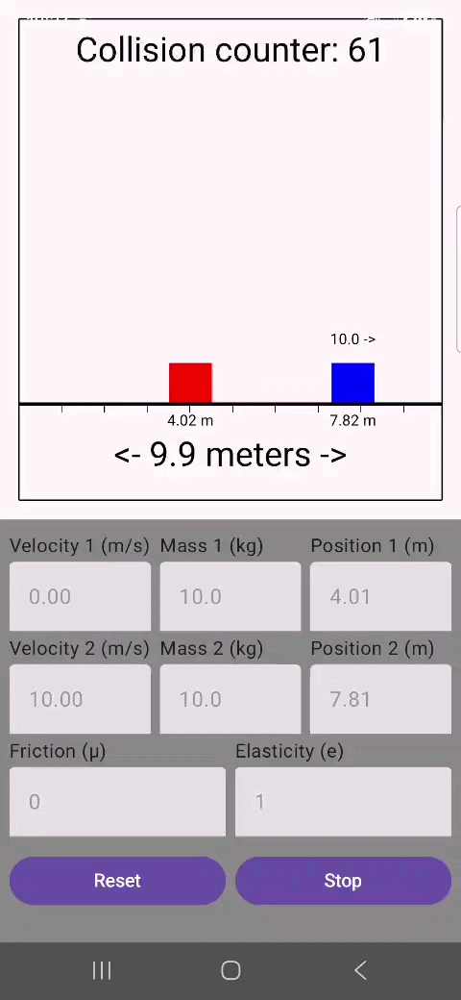

# Cube Collision Simulation

A **1D physics simulation** of two cubes colliding with walls and each other, built with **Jetpack Compose for Android**. Adjust **mass, velocity, position, friction, and elasticity** and watch how the cubes interact in real-time, visualizing **elastic collisions, friction, and velocities**. Perfect for learning basic physics concepts or experimenting with simple game mechanics.

## Features

- Real-time simulation at **60 FPS**
- Adjustable parameters:
    - Cube **mass** and **velocity**
    - Cube **position**
    - **Friction** coefficient (μ)
    - **Elasticity** (coefficient of restitution e)
- Collision detection between cubes and walls
- Dynamic cube sizing based on mass
- Collision counter and velocity display
- Sound effect on collision
- Start, stop, and reset controls

